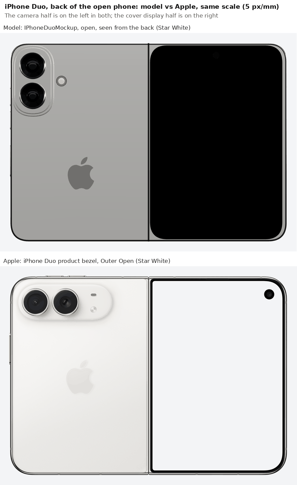
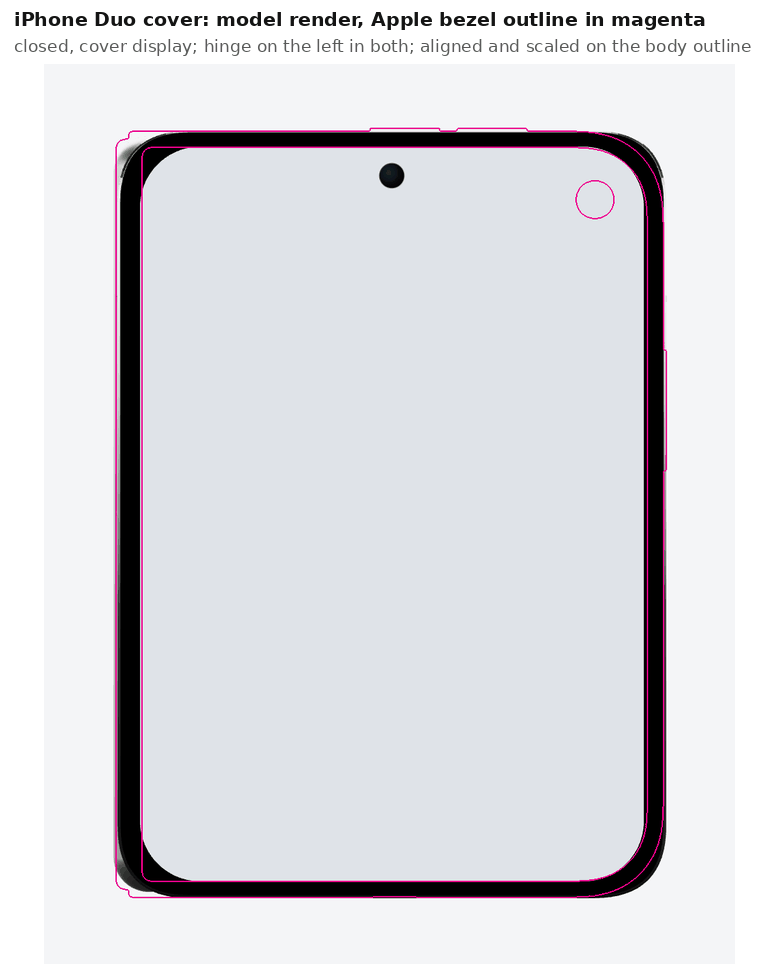
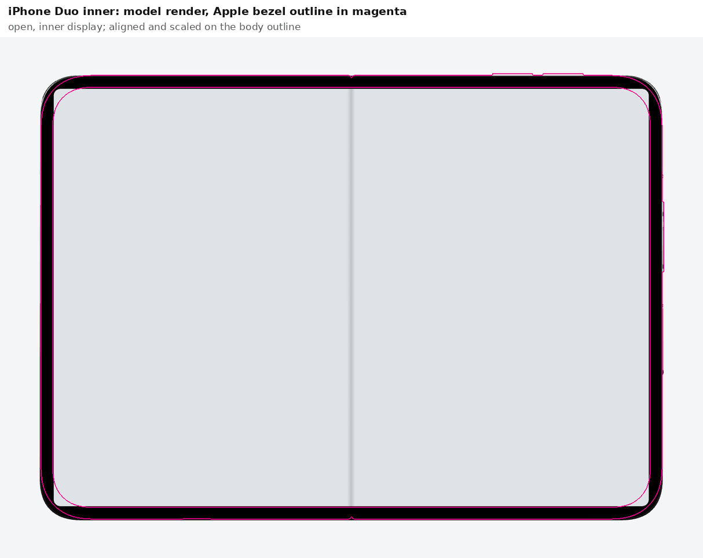
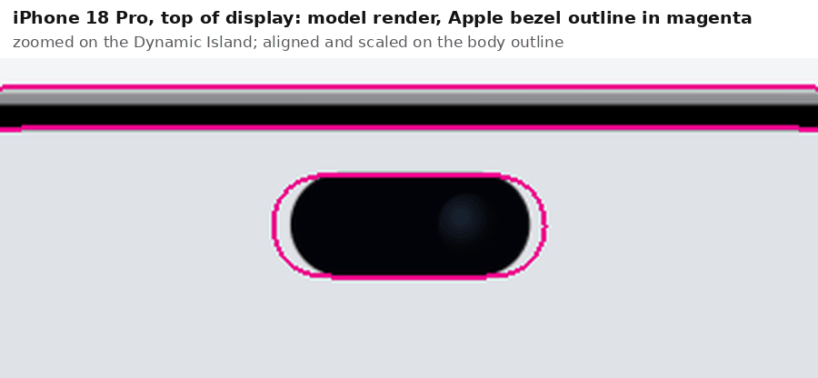
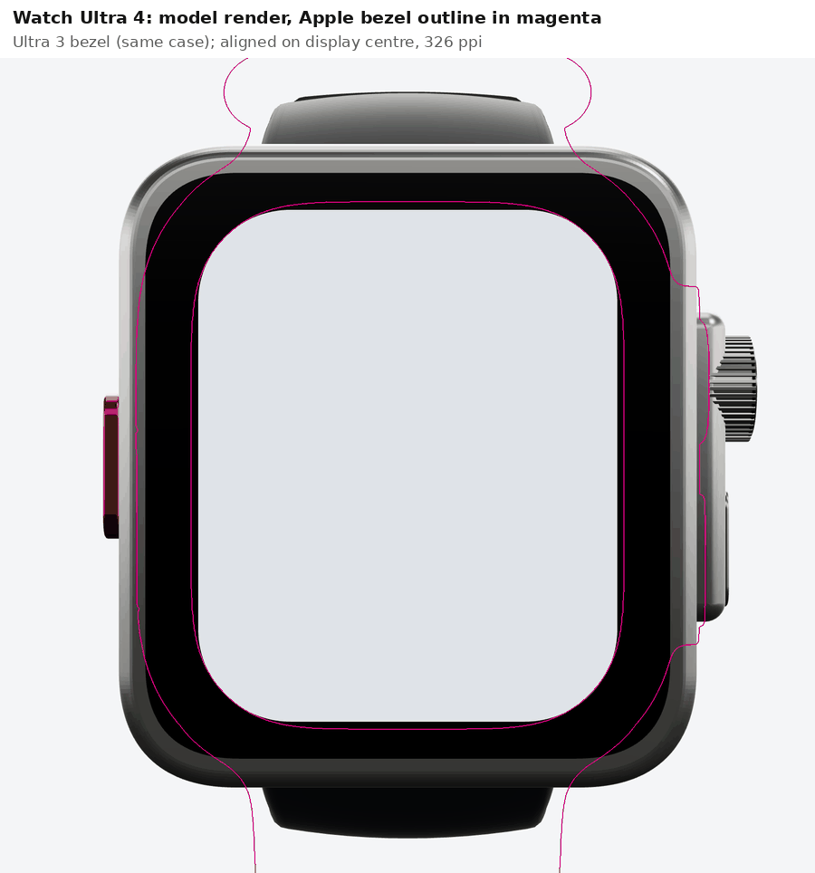
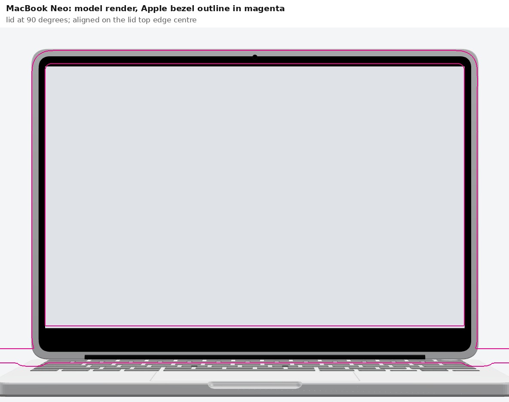
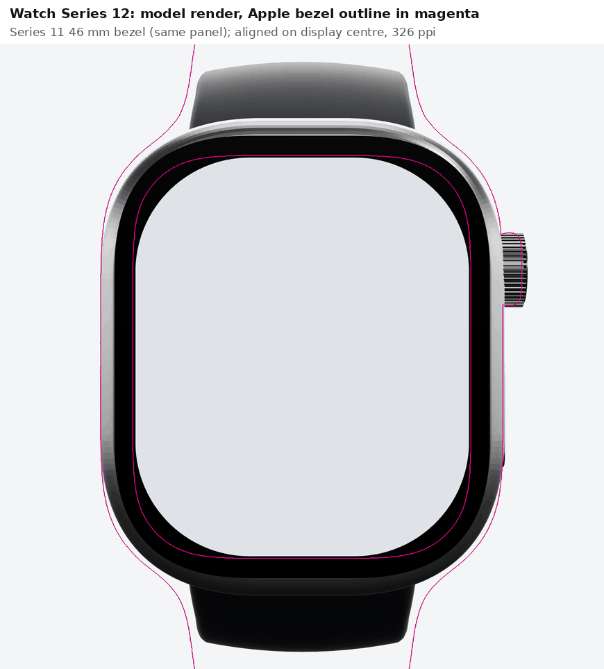
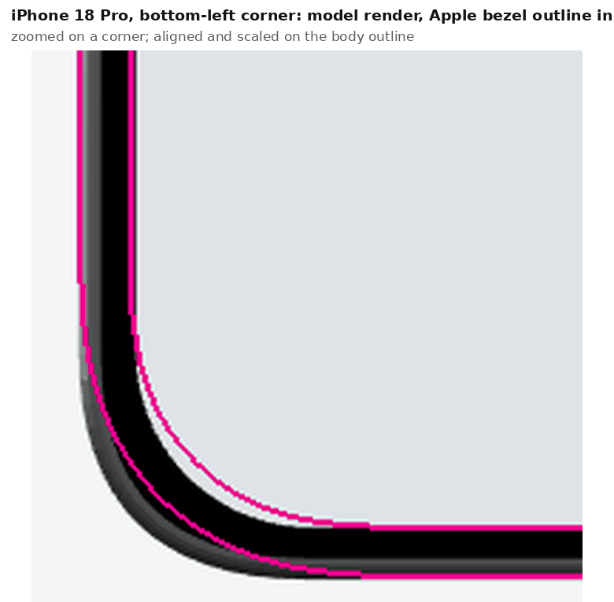

# Model review: the 2026 Apple additions against Apple's photos and product bezels

**Date:** 2026-09-25 · **Reviewing:** `0fd524c` on `claude/bold-bohr-hjtaw9` (#50) · **Reviewer:** Claude Code

> **Bottom line:** the published outer dimensions and panels are right on all six new models. Apple's own
> bezel artwork measures within 0.3 mm of every body and display size. The problems are in the
> detail, and they are not evenly spread:
>
> - **The iPhone Duo is the one with real errors.** The rear camera module is rotated 90° and sits
>   in the wrong place. The cover punch hole is centred when it should be in the top-right corner.
>   The volume keys are on the wrong edge. None of the asymmetric corners are modelled.
> - **The iPhone 18 Pro island is too narrow.** It is 13.5 mm against Apple's 15.6 mm.
> - **The Watch Ultra 4 case is 2.6 mm too wide and its display too small.** The front reads
>   visibly chunkier than the real watch.
> - **The MacBook Neo has black keycaps and square display corners.** The real keycaps are
>   colour-matched and light, and the real display corners are rounded. The ports also sit about
>   10 mm off.
> - **The Series 12 display corners are too round.** The display area comes out 6% small.
>
> The bezel benchmark also turned up issues in older models that this branch did not touch. The
> iPad display corners are 1.4–2.3× too round. The MacBook Air top bezel is 2.6–2.9 mm too
> deep. The 17 Pro's display corners, which the 18 Pro inherits, are about 2 mm too tight.

## Method

**Sources.** Every finding is checked against Apple's own material, in this order:

1. **Product bezels** from [Apple Design Resources](https://developer.apple.com/design/resources/#product-bezels).
   These are head-on PNG renders with the screen cut out as transparency.
2. **Newsroom photography** for the parts a bezel cannot show: backs, sides and keycaps.
3. **Technical specifications pages** for published dimensions and display areas.

**Bezel measurement.** The bezels were measured from the alpha channel with a small script that
finds the enclosed screen, the body outline and any cutout islands.

- **Scale** comes from each panel's native pixel density. The table lists the value per family.
  Every scale was cross-checked against the published body size, and all agree within 0.3%.
- **Corner radii** are the equivalent circular radius at the 45° point. That is the only fair way
  to compare Apple's continuous-curvature corners with the model's circular or quadratic ones.
  The same measurement was run on the model renders.
- **The watch scale** is fixed by the published display area. At 326 ppi the Series 11 bezel's
  screen comes to 1198 mm² against Apple's 1196. The Ultra 3's comes to 1247 mm² against 1245.

| Family | Bezel scale | Cross-check |
| --- | --- | --- |
| iPhone 17 / 18 Pro, Air, Pro Max | 460 ppi, 18.11 px/mm | 18 Pro body 71.84 × 149.97 mm (published 71.9 × 150.0) |
| iPhone Duo | 18.09 px/mm, from the 117.8 mm height | Closed 84.2 mm wide, open 164.6 mm (both as published) |
| Apple Watch | 326 ppi, 12.84 px/mm | Display areas as published; Ultra case height 48.6 mm (49) |
| iPad | 264 ppi, 10.39 px/mm | iPad Pro 13″ body 215.9 mm (215.5) |
| MacBook Neo / Air / Pro | 219 / 224 / 254 ppi | Neo lid 298.1 mm (297.5), Air 13″ 304.0 (304.1), Pro 14″ 313.4 (312.6) |
| Studio Display | 218 ppi, 8.58 px/mm | Enclosure 624.1 × 363.0 mm (623 × 362) |

**Model numbers** were read from the source specs, bundled with esbuild, and converted with each
family's `*_MM_PER_UNIT`. The six new devices were also rendered head-on through the docs harness
(`/harness`, far camera, `screen=light`), with Apple's bezel outline drawn over each render in
magenta. Phones are aligned and scaled on the body outline. Watches are aligned on the display
centre at 326 ppi. The Neo is aligned on the lid's top edge. The overlays are accurate to
within about half a millimetre. The numbers below come from the specs and the bezels, not from reading the overlays.

**Bezel stand-ins.** Apple publishes bezels for the Watch Ultra 3 and Series 11, not the Ultra 4
and Series 12. Both were used as stand-ins, which is sound:

- The Ultra 4 publishes the Ultra 3's 49 × 44 × 12 mm case and 422 × 514, 1245 mm² panel.
- The Series 12 publishes the Series 11's 416 × 496 panel.

The iPhone 18 Pro, 18 Pro Max, Duo and MacBook Neo all have bezels of their own.

## Findings

Ranked by how visible each one is in a normal hero shot.

### 1. iPhone Duo: the back layout is wrong (high)

The model carries the iPhone 17's vertical two-lens pill. The Duo has a horizontal camera
plateau of its own across the top of the camera half, with the mic and flash inside it.

The table measures from Apple's Outer Open bezel. Positions are from the free (non-hinge) edge
and from the top edge of the camera half.

| Feature | Apple | Model |
| --- | --- | --- |
| Plateau | Horizontal stadium, 55.8 × 21.3 mm, 4.8 mm from the free edge and 4.4 mm from the top | Vertical pill, 24.9 × 42.3 mm, centred 13.6 mm from the free edge and 22.5 mm from the top |
| Lenses | Ø16.2 mm, side by side, centres 15.1 and 32.8 mm from the free edge, 15.1 mm down | Ø16.0 mm, stacked, centres 13.6 mm in, 13.6 and 31.4 mm down |
| Mic | 3.2 × 1.4 mm pill inside the plateau, 49.6 mm in, 10.9 mm down | none |
| Flash | Ø3.7 mm inside the plateau, 49.6 mm in, 19.7 mm down | Ø6.3 mm on the flat back, 30.4 mm in, 22.5 mm down |
| Logo | 16.3 × 20.0 mm, centre 0.8 mm below the middle | 15.8 × 19.4 mm, centre 18.3 mm below the middle |

The lens size and 17.7 mm pitch are right. They sit on the wrong axis. `rearCamera` needs a new
horizontal module for both poses, and the logo moves up to the middle.

### 2. iPhone Duo: the cover punch hole is centred and too small (high)

Apple's cover camera sits in the top-right corner, on the free-edge side. It is a Ø6.0 mm
cutout 10.5 mm from the free edge and 10.6 mm from the top of the body. The model draws a
Ø3.9 mm hole centred across the width, 7.2 mm from the top. `punchHole` has only `offsetY`, so
this needs an `offsetX` or a corner anchor.

### 3. iPhone Duo: the keys are on the wrong edges (high)

The model puts volume up, volume down and the Touch ID button on the free rail. Apple puts them
in two places:

- **Volume keys:** two 10.8 mm keys on the top edge of the camera half, standing 0.5 mm proud.
  Measured on the closed phone, they span 39.0–49.8 mm and 52.4–63.3 mm from the hinge.
- **Touch ID side button:** the only key on the free rail. It is 18.6 mm long, centred
  15.9 mm above the middle.

The model's side button is the right length, 18.3 mm, but it is centred 11.0 mm below the middle.
The volume keys also show as magenta bumps on the top edge in the cover and inner-display
overlays. `buttons` has no `edge` field on `FoldSpec`, so this needs the same `edge` option the
watch spec gained.

### 4. iPhone Duo: corners are symmetric where Apple's are not (medium–high)

| Corner (equivalent radius) | Apple | Model (rendered) |
| --- | --- | --- |
| Closed body, hinge side | 4.3 mm | 7.0–7.8 mm |
| Closed body, free side | 12.4 mm | 9.2–9.6 mm |
| Cover display, hinge side | 1.3 mm | 9.2 mm |
| Cover display, free side | 9.6 mm | 9.2 mm |
| Inner display, all four | 8.9 mm | 1.8 mm |
| Open body, all four | 12.4 mm | 9.1–10.0 mm |

Apple's cover display is also shifted toward the free edge. The borders are 4.3 mm at the hinge,
2.65 mm at the free edge and 2.7 mm top and bottom. The model centres it with 3.2 mm each side.

The inner display is the most visible of these. The model's near-square corners read as a
different product from Apple's round ones. Per-corner radii already exist as
`roundedRectShapeCorners`.

The inner display correctly has no punch hole. Apple's newsroom says its FaceTime camera sits
under the display, and the bezel has no cutout.

### 5. iPhone 18 Pro and 18 Pro Max: the Dynamic Island is 2.1 mm too narrow (medium)

| | Apple bezel | Model |
| --- | --- | --- |
| 18 Pro island | 15.57 × 5.96 mm, centre 5.33 mm below the display top | 13.49 × 5.94 mm, centre 5.57 mm |
| 18 Pro Max island | 15.52 × 5.91 mm, centre 5.35 mm | 13.49 × 6.06 mm, centre 5.28 mm |
| 17 Pro island, for reference | 20.65 × 5.96 mm | 19.62 × 5.94 mm |

The spec comment calls 13.49 mm "the pre-launch measurement of the panel cutout" and says Apple's
drawings had yet to publish. They now have. Apple's 18 Pro island is 25% narrower than the 17 Pro's,
not 35%. `IPHONE_18_ISLAND_WIDTH` should be 0.419 world units (15.57 mm).

The comment also gives the 17 Pro island as 20.76 mm while the 17 Pro spec draws 19.62 mm. Apple's
bezel says 20.65 mm, so the 17 Pro's own island is about 1 mm narrow too.

### 6. Watch Ultra 4: case too wide, display too small (medium)

Apple's published 44 mm width includes the crown guard and crown. The bezel's case, without the
guard, is 41.4 mm wide. The guard adds 1.6 mm and the crown another 0.7 mm, which comes to
43.7 mm. The model instead makes the case itself 44.0 mm and then adds the guard and crown
outside it.

| | Apple (Ultra 3 bezel, 326 ppi) | Model |
| --- | --- | --- |
| Case width without guard | 41.4 mm | 44.0 mm |
| Display | 32.9 × 40.1 mm, 9.0 mm corners, 1245 mm² | 31.9 × 38.9 mm, 7.1 mm corners, about 1198 mm² |
| Case edge to display | 4.3 mm on every side | 6.05 mm sides, 5.05 mm top and bottom |
| Crown guard | 27.6 mm long, 1.6 mm proud | 24.1 mm long, 2.5 mm proud |
| Crown | Ø8.4 mm, 2.3 mm proud of the case | Ø8.3 mm, 4.6 mm proud |
| Side button | 9.7 mm, centre 7.2 mm below the display centre | 8.85 mm, centre 6.4 mm below |
| Action button | 13.0 mm, centre 4.1 mm below the display centre, nearly flush in front view | 11.0 mm, centred, 1.6 mm proud |

The 422 × 514 panel is 32.9 × 40.1 mm at Apple's 326 ppi, and that is the only size that
reproduces the published 1245 mm². The spec's "1.98″ → 31.9 × 38.9 mm" undersizes it.

Newsroom photography of the black Ultra 4 also shows an orange ring on the crown's face, which
the model does not draw.

### 7. MacBook Neo: keycaps, display corners, bezel, camera and ports (medium)

- **Keycaps.** Apple's launch photography shows keycaps colour-matched to the case, in light
  tints on all four finishes. The model draws the dark keycaps of the Air and Pro. This is the
  most visible Neo difference in any open pose.
- **Display corners.** Apple's bezel rounds the top corners at 4.0 mm, like the Air and Pro, and
  squares the bottom ones. The spec has `radius: [0, 0, 0, 0]`, and its comment says
  "square corners".
- **Top bezel.** Apple's is 9.4 mm, the same as the sides. The model's is 11.15 mm, with sides of
  8.8 mm. `offsetY` 0.086 instead of 0.062 matches Apple.
- **Camera.** Apple's is Ø1.7 mm, centred 4.5 mm above the display. The model's is Ø3.5 mm at
  5.4 mm.
- **Ports.** Measured from Apple's side photo and scaled by the model's own 12.7 mm thickness:
  - The two USB-C ports are about 23 and 37 mm from the back edge. The model has them at 34 and
    48 mm.
  - The headphone jack is about 53 mm from the back. The model has it at 45 mm.
  - The sides are right: both USB-C on the left, the jack on the right.
- **Speaker.** The right side has a 27 mm speaker slot between the jack and the hinge, 20–48 mm
  from the back. The model has none.
- **Colours.** Indigo and Citrus are off. See finding 10.

### 8. Watch Series 12: display corners too round (medium–low)

The case outline matches Apple's bezel closely. The display does not.

| | Apple | Model |
| --- | --- | --- |
| Display | 32.4 × 38.6 mm, 8.0 mm corners | 32.0 × 38.2 mm, 10.9 mm corners |
| Display area | 1196 mm² | about 1119 mm² |

The spec comment says the Series 12 is "46 x 40 x 9.7 mm", and Apple's Series 12 spec page does
list 40 mm. The geometry, the Series 11 header comment and the Series 11 bezel all say 39 mm. One
of the two should change so that the comment and the geometry agree.

The colorways match Apple's specs page and newsroom text exactly. One newsroom image file is named
"Silver Aluminum", but Apple's text says space gray.

### 9. iPhone 18 Pro: display and body corners too tight, inherited from the 17 Pro (medium–low)

Apple's bezels give the 17 Pro, 17 Pro Max, 18 Pro and 18 Pro Max identical corners. The model
does not.

| Corner (equivalent radius) | Apple | 18 Pro / 17 Pro model | 18 Pro Max / 17 Pro Max model |
| --- | --- | --- | --- |
| Display | 10.4 mm | 8.3 mm rendered (spec 0.23) | 10.2 mm (spec 0.274) |
| Body silhouette | 13.0 mm | about 9.5 mm rendered (spec 0.289) | spec 0.34 |

The Pro Max's display corner is right. Setting the Pro's `display.radius` to 0.279 world units
(10.37 mm) matches Apple. Raising `body.radius` from 0.289 to at least the Pro Max's 0.34 brings
the silhouette in line with its sibling. Check the result against the bezel, because the rendered
bevel rounds the silhouette further. Both changes fix the 17 Pro as well.

### 10. Colours (low)

These are sampled from Apple's bezel renders, which are lit evenly, and cross-checked against
newsroom photos.

| Finish | Apple sample | Model | Note |
| --- | --- | --- | --- |
| 18 Pro Silver rail | `#c4c4c4` | `#c6c8cc` | Fine |
| 18 Pro Black rail | `#2e2c2e` | `#3a3d43` frame, `#1e1f23` body | Fine |
| 18 Pro Glacier rail | `#bdc9d9`; photo back `#9ba7b9` | `#adc3d2` frame, `#c4d8e6` body | Model is more cyan and saturated than Apple's grey-blue |
| 18 Pro Burgundy rail | `#59373d` | `#7c3b4e` frame, `#6a2b3e` body | Model is pinker and brighter than Apple's muted wine |
| Duo Night Sky back | `#2d3642` | `#1f2740` | Model is darker and bluer than Apple's slate |
| Duo Star White back | `#e8e7e5` | `#f1f0ec` | Fine |
| Neo Indigo | base `#56637b`; photo lid `#626a7d` | `#3b4470` | Model is far darker and more violet than Apple's slate blue |
| Neo Citrus | base `#d2d086`; photo lid `#ebe9a8` | `#e9d98a` | Apple's is green-yellow, with red equal to green; the model's is golden |
| Neo Blush / Silver | `#d6bfbf` / `#c8c9cb` (shaded edge) | `#e9cfd0` / `#e3e4e6` | Fine |
| Ultra Natural titanium | `#cfc6bd` | `#c9c8c3` | Model is a touch cool; Apple's is warm |

## Benchmark of the existing Apple models

These pre-date this branch. They are listed because the bezels make them cheap to check.

| Model | Sizes vs bezel | Deviation |
| --- | --- | --- |
| iPhone 17 | Body and display within 0.3 mm; island 20.80 vs 20.65 mm | Island centre 0.6 mm low (5.94 vs 5.32 mm) |
| iPhone Air | Within 0.3 mm; island 20.69 vs 20.65 mm | Island centre 0.5 mm low (6.80 vs 6.32 mm) |
| iPhone 17 Pro | Within 0.3 mm | Island 1 mm narrow, corners tight (findings 5 and 9) |
| iPhone 17 Pro Max | Within 0.3 mm; island 20.84 vs 20.60 mm; display corner 10.2 vs 10.4 mm | None worth fixing |
| iPad Pro 13″ / 11″ | Display within 0.6 mm | Display corners 10.2 / 9.6 mm vs Apple's 5.6 mm |
| iPad Air 13″ / 11″ | Display within 0.1 mm | Display corners 7.7 / 7.0 mm vs Apple's 3.3–3.6 mm |
| iPad (A16) | Display within 0.1 mm | Display corners 6.4 mm vs Apple's 4.6 mm |
| MacBook Air 13″ / 15″ | Display and notch within 1 mm | Top bezel 9.8 / 9.3 mm vs Apple's 6.9 / 6.7 mm; display corners 6.5 vs 3.9 mm |
| MacBook Pro 14″ | Display, bezel, notch within 0.3 mm | Display corners 4.6 vs 3.8 mm (minor) |
| MacBook Pro 16″ | Display and notch within 0.5 mm | Top bezel 4.7 vs 5.6 mm |
| Studio Display | Enclosure, panel and 13.9 mm border within 1 mm | Display corners 3.45 mm; Apple's panel is square-cornered |

**iPad corners.** The iPad corners are the one systemic miss. Every iPad draws its screen corners
1.4–2.3× Apple's, which shows in any straight-on iPad shot.

**MacBook Air top bezel.** The model places the display from the lid centre, and the lid is as
tall as the base is deep. On the Air that pushes the display 2.6–2.9 mm too far down. The Neo shows
the same effect at 1.8 mm.

## Verified

- **All six new models** match their published body sizes and panel sizes, and Apple's bezels
  agree within 0.3 mm:
  - 18 Pro: body 71.89 × 150.01 mm, against 71.84 × 149.97 mm measured.
  - Duo inner display: 157.9 × 111.1 mm, against 157.7 × 110.9.
  - Duo cover display: 77.7 × 113.0 mm, against 77.3 × 112.4.
  - Neo display: 280.0 × 175.1 mm, against 279.3 × 174.7.
- **Duo lenses:** Ø16.0 mm at a 17.7 mm pitch, against Apple's Ø16.2 at 17.7.
- **Ultra crown diameter:** 8.3 mm against 8.4.
- **Series 12 case outline** and all eight **Series 12 colorways**.
- **18 Pro:** the island height, and its drop from the display top to within 0.25 mm.
- **Neo:** the port sides, and no notch.

## Corrections to my own earlier notes

The first, photo-only pass got some things wrong. The bezels settle them.

- **Neo ports.** I first said the ports were on opposite sides from the real ones. They are not.
  Both USB-C ports are on the left and the jack is on the right, as modelled. Only their
  positions along the side are off.
- **Ultra 4 crown and keys.** From photos I estimated an 11 mm crown, a 12 mm side button and a
  31 mm guard. The bezel gives 8.4, 9.7 and 27.6 mm. The crown is right in the model. Scaling
  photos by the published 44 mm width, which includes the guard, inflated every estimate.
- **Neo top bezel.** From photos I estimated 8.2 mm. The bezel gives 9.4 mm.
- **Duo camera plateau.** From photos I estimated about 53 × 23 mm. The bezel gives
  55.8 × 21.3 mm.

## Suggested order of fixes

None of these are applied. This document is the review.

1. **Duo back module and logo** (1): a new horizontal plateau with the lenses, mic and flash
   inside it, mirrored for the open pose.
2. **Duo keys** (3): top-edge volume keys, and the side button moved up the free rail. This
   needs `edge` on fold buttons.
3. **Duo punch hole** (2), **cover display offset and corners** (4): per-corner radii and an
   x offset.
4. **18 Pro island width** (5): a one-constant change, then refresh the baselines.
5. **Neo keycaps, corners, bezel and camera** (7): mostly spec numbers. Keycap colour needs a
   per-colorway key colour.
6. **Ultra 4 case width and display** (6): a 41.4 mm case with the display at 32.9 × 40.1 mm.
   The guard, crown and Action button follow.
7. **Series 12 display corners** (8) and **Pro corners** (9).
8. **Colours** (10), then the older iPad and MacBook Air items.

## Sources

- [Apple Design Resources: product bezels](https://developer.apple.com/design/resources/#product-bezels):
  iPhone 18, iPhone Duo, iPhone 17, Apple Watch Series 11 and Ultra 3, MacBook Neo, MacBook Air M5,
  MacBook Pro M5, iPad Pro M5, iPad Air M4, iPad A16 and Studio Displays 2026.
- [Apple unveils iPhone Duo](https://www.apple.com/newsroom/2026/09/apple-unveils-iphone-duo/)
- [Apple debuts iPhone 18 Pro and iPhone 18 Pro Max](https://www.apple.com/newsroom/2026/09/apple-debuts-iphone-18-pro-and-iphone-18-pro-max/)
- [Apple unveils Apple Watch Ultra 4](https://www.apple.com/newsroom/2026/09/apple-unveils-apple-watch-ultra-4/)
- [Introducing Apple Watch Series 12](https://www.apple.com/newsroom/2026/09/introducing-apple-watch-series-12-with-the-all-new-health-sensing-system/)
- [Apple Watch Series 12: technical specifications](https://www.apple.com/apple-watch-series-12/specs/)
- [Say hello to MacBook Neo](https://www.apple.com/newsroom/2026/03/say-hello-to-macbook-neo/)
- [iPhone Duo: technical specifications](https://www.apple.com/iphone-duo/specs/)
- [Apple Watch Ultra 3: tech specs](https://support.apple.com/en-us/125095), for the 1245 mm² display area.
- [Apple Watch Series 11: tech specs](https://support.apple.com/en-us/125093)
