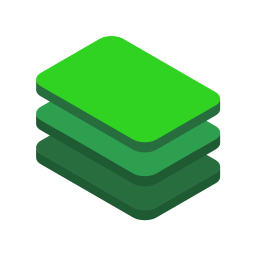

# App icon

Square, transparent-background renderings of the adopted stack mark
([`../logo-stack-green.svg`](../logo-stack-green.svg)), for the places that ask
for "a logo image" and mean a square file: a GitHub App or OAuth app avatar, an
npm org, a Slack or Discord integration, a favicon source.

| File | Use |
| --- | --- |
| [`logo-stack-square.svg`](logo-stack-square.svg) | The master. Vector, so it re-renders at any size the list below doesn't cover. |
| [`logo-stack-square-1024.png`](logo-stack-square-1024.png) | Upload this one. GitHub, npm and friends all downscale from whatever you give them, and 1024 is the largest size any of them use. |
| [`logo-stack-square-512.png`](logo-stack-square-512.png) | Where 1024 is over an upload limit. |
| [`logo-stack-square-256.png`](logo-stack-square-256.png) | Avatars, README badges, docs. |
| [`logo-stack-square-128.png`](logo-stack-square-128.png) | The smallest size the mark still reads at. Below this use the favicon at `apps/docs/app/icon.svg`. |

## What "square with whitespace" means here

The adopted mark's own file is cropped to the artwork's bounds - no padding at
all - because the docs header sizes it by height and wants every pixel to be
ink. An app icon is the opposite case: the host crops it to a circle or a
rounded square, and a mark that runs to the edge loses its corners.

So these carry **14% of the canvas as clear space on each side**, leaving the
mark at 72% of the width. That survives a circular crop (a circle inscribed in
the square still clears the mark's corners) without shrinking it to a speck in
a square one.

The padding is transparent, not white: an icon that ships a white square looks
correct on a light page and like a sticker on a dark one.

## Regenerating

The PNGs are rendered from `logo-stack-square.svg` by headless Chromium at
1024x1024 and box-downsampled from there, so the small sizes are supersampled
rather than re-rasterised - which is what keeps the isometric edges clean at
128px. Nothing in the build depends on them; they are checked in because they
are uploaded by hand.

If the artwork ever changes, redraw `logo-stack-square.svg` from the adopted
file (it is that drawing, unmodified, inside a padded square viewBox) and
re-render.
