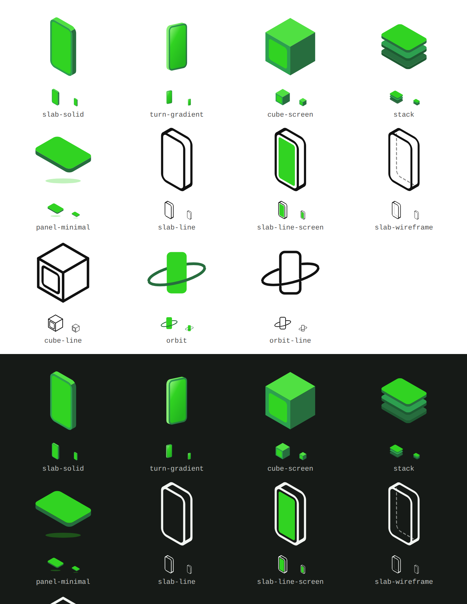

# Logo candidates

**`stack.svg` was chosen.** It ships as [`../logo-stack-green.svg`](../logo-stack-green.svg)
and is the mark used in the README, the docs header and the favicon. The adopted
copy is the same drawing with its viewBox cropped to the artwork's own bounds, so
its rendered size is not padded; the file here is left at its original framing as
the record of what was picked from. The rest of this folder is kept as the
alternatives that were considered.

Eleven candidate marks for react-3d-mockups, in three families: solid 3D shapes,
line-only, and abstract. Every file is a 256 × 256 SVG with the mark centred and
roughly 15 % breathing room, drawn in the same 30° isometric projection and the
same greens as the previous dual-slant "A" (`../area-a-dual-slant-green.svg`), so
any of them can sit next to the existing wordmark without a palette change.

## The candidates

| File | Family | What it is |
| --- | --- | --- |
| [`slab-solid.svg`](slab-solid.svg) | 3D shapes | An upright phone as a rounded slab, four flat tones: lit top, shaded side, bezel, bright screen. The most literal "3D device" mark and the strongest at 16 px. |
| [`turn-gradient.svg`](turn-gradient.svg) | 3D shapes | The same phone turned 38° with a 16° tilt, shaded with soft gradients instead of flat tones. Closest to the look of the rendered hero image. |
| [`cube-screen.svg`](cube-screen.svg) | 3D shapes | An isometric cube with a screen set into its front face. Keeps the cube language of the current mark. |
| [`stack.svg`](stack.svg) **(chosen)** | Abstract | Three flat screens stacked and receding into shadow: "mockups", plural, layered. |
| [`panel-minimal.svg`](panel-minimal.svg) | Minimal | One floating screen with a thin edge and a soft glow beneath it. Two shapes and a shadow. |
| [`slab-line.svg`](slab-line.svg) | Line-only | The slab as a single-weight outline. Nothing but the silhouette and the two edges that make it 3D. |
| [`slab-line-screen.svg`](slab-line-screen.svg) | Line-only | The outline with one solid green screen inside it. A line mark that still has a green area to anchor a favicon. |
| [`slab-wireframe.svg`](slab-wireframe.svg) | Line-only | A true wireframe: hidden edges dashed and visible through the body. The most "engineering" of the set. |
| [`cube-line.svg`](cube-line.svg) | Line-only | The cube-and-screen candidate as an outline. |
| [`orbit.svg`](orbit.svg) | Abstract | A flat phone with an isometric ring passing behind and in front of it: rotation, the thing the library does that a static mockup cannot. |
| [`orbit-line.svg`](orbit-line.svg) | Line-only | The orbit as an outline. The ring breaks where it passes behind the phone, and the phone outline breaks where the ring passes in front. |

## Notes for choosing

- **Small sizes.** The solid marks hold their shape at 16 px. Line-only marks are
  drawn at a 9-unit stroke (3.5 % of the box), which is about one device pixel at
  28 px, so they are best used at 32 px and above; see the comment in
  `apps/docs/components/logo.tsx` on why the previous outline variant was reverted.
- **Colour.** Solid marks use the existing palette: `#31D322` (brand), `#50E042`
  (lit), `#2D9F4F` (mid), `#276D3E` (shade), `#1E5A32` (deep). Line-only marks
  are stroked in `currentColor`, so inlined in the docs they follow the text colour
  and work on both themes with no dark variant; opened as a file they render black.
- **Adopting one.** The docs site inlines the mark in `apps/docs/components/logo.tsx`
  and uses it again in `apps/docs/app/icon.svg`. The viewBox of every candidate is
  already the mark's own bounds plus padding, so `size` maps to the visible height.
